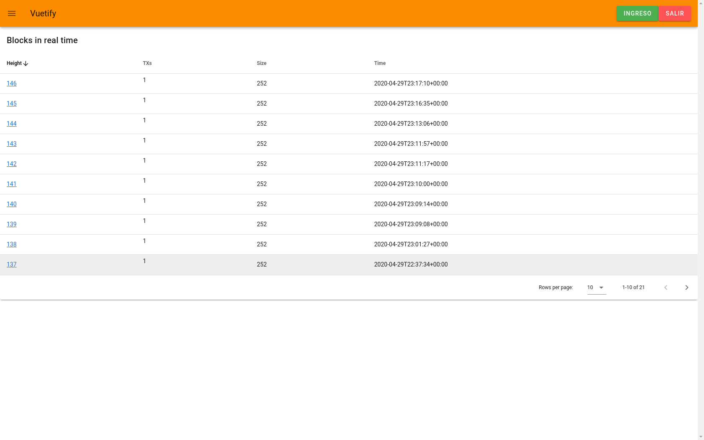

# bitcoind-wrapper

## Install v0.2: hasura + cron +subscriptions for websockets and auto-api generator as lb4
- ```git clone https://github.com/aitoribanez/bitcoind-wrapper```
- ```cd bitcoind-wrapper```
- make .env for front/bitcoind-zmq in front/bitcoind-zmq/.env with
```
VUE_APP_HASURA_PASS=secretkey
VUE_APP_HASURA_SCHEMA=ws://localhost:8080/v1/graphql
```
- ```docker network create back```
- ```docker network create front```
- ```docker-compose up --build -d```
- Open on browser for hasura console: ```http://localhost:8080/```

## bitcoin.conf example for regtest
```
# Use the regtest network, because we can generate blocks as needed.
regtest=1

# RPC is required for bitcoin-cli.
server=1
rpcuser=paco
rpcpassword=paco

# In this example we are only interested in receiving raw transactions.
# The address here is the URL where bitcoind will listen for new ZeroMQ connection requests.
zmqpubhashblock=tcp://0.0.0.0:3000
zmqpubrawblock=tcp://0.0.0.0:3001
# zmqpubrawtx=tcp://0.0.0.0:3002
# zmqpubhashtx=tcp://0.0.0.0:3003

# ATTENTION: VERY DANGEROUS OUTSIDE THE DOCKER NETWORK
[regtest]
rpcbind=0.0.0.0:18443
rpcallowip=0.0.0.0/0
```
## bitcoin.conf example for testnet
```
# testnet
testnet=1

# RPC is required for bitcoin-cli.
server=1
rpcuser=paco
rpcpassword=paco

txindex=1

# blocknotify=/usr/bin/curl -X GET bitcoindwrapper:3000/bitcoin/newblock/%s -H "accept: application/json" -H "Authorization: Bearer YOUR-TOKEN"

# In this example we are only interested in receiving raw transactions.
# The address here is the URL where bitcoind will listen for new ZeroMQ connection requests.
zmqpubhashblock=tcp://0.0.0.0:3000
zmqpubrawblock=tcp://0.0.0.0:3001
# zmqpubrawtx=tcp://0.0.0.0:3002
# zmqpubhashtx=tcp://0.0.0.0:3003

# ATTENTION: VERY DANGEROUS OUTSIDE THE DOCKER NETWORK
[test]
rpcbind=0.0.0.0:18332
rpcallowip=0.0.0.0/0
```

## .cookie
```
paco:paco
```

## Ports

8080: Hasura console
3001: frontend (8081 with ```npm run serve```)


## Generate new block on regtest

- ```bitcoin-cli generatetoaddress number_blocks address```
- Listar las direcciones del nodo: ```bitcoin-cli getaddressesbylabel ""```

## Miscelania

### TODO zmq
 - Al levantar hasura o postgresql que meta la tabla de block (id: UUID, autogenerado, unico y hash: text)

### hasura call to getblockcount
curl 'http://localhost:9000/' -H 'Accept-Encoding: gzip, deflate, br' -H 'Content-Type: application/json' -H 'Accept: application/json' -H 'Connection: keep-alive' -H 'DNT: 1' -H 'Origin: http://localhost:9000' --data-binary '{"query":"query {\n  getblockcount {\n    height\n  }\n}"}' --compressed

curl -X POST http://localhost:8080/v1/graphql -H 'x-hasura-admin-secret: secretkey' -H 'Content-Type: application/json' -d '{"query":"query{\n  getblockcount {\n    height\n  }\n}"}'

### bitcoin-rpc call to getblockcount
curl --user paco --data-binary '{"jsonrpc": "1.0", "id":"curltest", "method": "getblockcount", "params": [] }' -H 'content-type: text/plain;' http://bitcoind:18443

###  Add "Remote Schema" in hasura
- Go to hasura explorer: http://localhost:8080/
- Click "Remote Schemas" -> "Add"
- As "GraphQL server URL" add "http://bitcoind-rpc:9000/"

### Screenshot front/bitcoind-zmq

